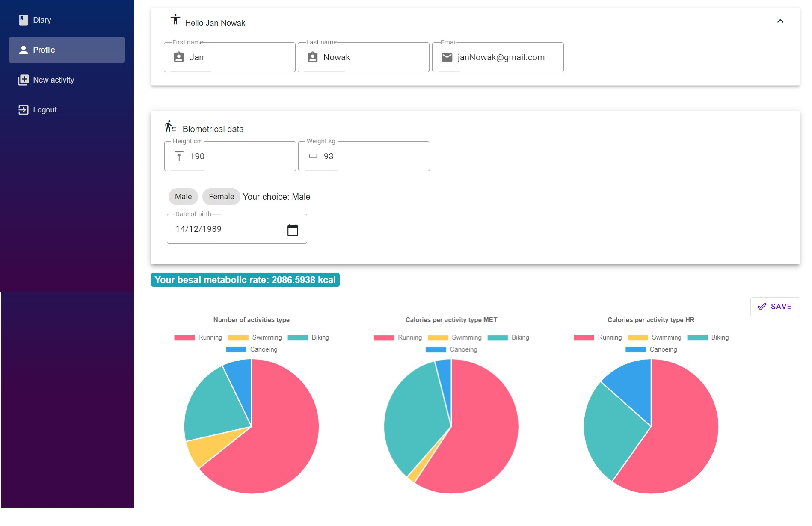

# Track-fitness-activities-statistics-web-app
Bachelor thesis: Energy expenditure estimation based on data from wearable devices monitoring physical activity


The application that is the subject of the bachelor thesis work provides a tool that finds the energy expenditure of a person who trains, recording the activity with a wearables device, implementing a system that allows comparing and archiving the results. A wearable device, is an electronic device equipped with a microcontroller and a set of advanced electronic technologies designed to monitor vital functions and data from the environment. Sensors require direct contact with or proximity to the wearer's body, so they are worn on the surface of the skin.


## The solution implements two such methods:
* MET (Metabolic Equivalent of Task), calculates energy expenditure based on intensity tables.

MET tables describe activity intensity by assigning a value that is independent of the biometric data of the exerciser. One MET defines the value of energy consumed during rest and is equal to one kilocalorie expended by the body per kilogram of body weight for one hour. One MET is also equivalent to 3.5 milliliters of oxygen used to satisfy the work of a kilogram of body weight for one minute.

Formaula
```ruby
C = MET*weight*time
```

The original version of the method described in the research paper did not include differences in resting metabolic values in the calculations. This means that such important factors as gender, height and age were not included in the calculation of energy expenditure. A study showed that MET values are underestimated in 89% of cases. In order to improve the calculation method, the concept of corrected MET was introduced, which uses the Harris-Benedict formula (Formula II and Formula III) to calculate resting energy expenditure BMR (Basal Metabolic Rate).

Formaula for woman
```ruby
BMR =66+6.2*Weight+12.7*Height-6.76 *Age 
```
Formaula for man
```ruby
BMR =66.5+13.75*Weight+5.003*Height-6.755*Age
```

The conversion requires calculating the BMR and converting the result obtained in kilocalories to the number of milliliters of oxygen absorbed per kilogram of body weight per minute. The quotient of 3.5 ml/min〖*kg〗 and the obtained result is the adjustment factor for MET values.

Formaula
```ruby
Corrected MET = MET*  (3.5 (ml/min⁡〖*kg〗 ))/(Harris-Benedict BMR (ml/min⁡〖*kg〗 ))
```

The algorithm in the application was implemented using the adjusted MET value.

* Heart Rate method, focuses on calculating energy expenditure based on heart rate. Recording your heart rate during training is optional and dependent on the presence of a heart rate monitor. In the absence of heart rate data the energy expenditure will only be calculated using the MET method.

Formaula for woman
```ruby
C =[-20.4022+(0.4472*Hr)-(0.1263*Weight)+(0.074*Age)]*60/4.184*time
```
Formaula for man
```ruby
C =[-55.0969+(0.6309*Hr)+(0.1988*Weight)+(0.2017*Age)]*60/4.184*Time
```

## Training record files
Wearables and smartphones offer options to export workout files in gpx (GPS eXchange Format) and tcx (Training Center XML), (XML - Extensible Markup Language) formats. Files with the gpx extension are a format for recording training as a series of consecutive GPS navigation points in a standardized XML schema format. Sometimes the file also contains additional information such as heart rate, cadence.

In this paper, tcx file was used as a format for reading data from wearables. Files with the extension tcx are a format introduced by Garmin in 2007. They contain data about a training unit providing a lot of information that gpx files do not provide. In addition to recording geographic coordinates, tcx standardizes distance, heart rate, step cadence, and bicycle crank cadence. The tcx file consists of laps - Lap (Fig. 2.2-1) which contain lap information and a series of training points - TrackPoint located inside Track tags (Fig. 2.2.-2).


## System usage scenarios

After starting the application the user is shown the login page. The password is entered in a hidden form. 

<p align="center">
  
</p>

In the SignUp tab, the user can register by entering their details 

<p align="center">
  
</p>

After logging into the application the user is shown the Diary tab with the table of workouts imported to the application. At the first start-up both the table and the chart of energy expenditure are empty.
To add workouts, go to the New activity tab and upload the tcx file from the device disk - this can be done by clicking the Choose file button and selecting the appropriate file from the disk space dialog or dragging the file from the file explorer to the Choose file button.  Uploading a file is not an instant operation and should take a few seconds depending on the file size. After uploading the file you have to choose the sport you want to play by clicking on the shortcut button with an icon representing the sport, or if the sport is not among the buttons - from the drop-down list. The next step is to press the Upload button - if the file has been uploaded correctly and the sport is selected, the user will be taken to the Diary tab where the results of the file processing will be presented. If not, a message will be displayed telling the user what to do to import the file correctly. 

<p align="center">
  
</p>

In the Diary tab, the user can view the workouts they have imported into the program. 

<p align="center">
  
</p>

At the top of the page is a graph of energy expenditure per minute over successive time segments characterizing a given training unit, created from two methods. The curve in green represents the heart rate based method of calculating energy expenditure and the curve in red represents the MET tables. If the workout did not include heart rate information the green curve will not be displayed on the graph. By clicking on the chart legend buttons, you can turn the visibility of the curves off or on. Changes in visibility cause the graph to scale to the currently displayed data.

<p align="center">
  
</p>

Below the graph is a table with rows representing training units. The row shows the sport type, start time, distance covered, speed, duration and the calculated MET and HR value. You can sort the tables by each attribute by clicking on the corresponding heading. A training session can be deleted by clicking the trash can symbol in the lower left corner. The table also implements pagination.

<p align="center">
  
</p>

The Profiles tab provides a mechanism for editing user data. In the top panel, the user can modify the first name, last name and email address data. In the Biometrical data panel the user can modify the data of height, weight, gender and date of birth. On this basis, resting energy expenditure is calculated, i.e., the number of calories required to maintain basic life functions during the day. The result is presented in the blue box below. 

<p align="center">
  
</p>

<p align="center">
  
</p>

At the bottom of the panel three pie charts are presented. The first graph from the left shows how many training sessions of a given type have been imported to the program by the user. The middle graph shows the energy expenditure for each type of physical activity calculated based on the MET method, and the graph on the right shows the energy expenditure based on the HR method. 

<p align="center">
  
</p>

## Database structure
The database structure is built with five tables. The Users table represents the user, containing the data necessary to log into the system and the user's biometric data required to calculate energy expenditure. This table has a one-to-many relationship to the TrainingSession table, which represents the training session performed by the user. It contains the training data and a foreign key pointing to the Sport table, which contains information about what type of sport the training session belongs to. In addition to information about the type of sport, the table also contains information about whether the sport involves covering a distance, and thus the user's speed. The Met table assigns MET values to each sport for different speeds, and if a sport has no speed, it has a single value for the entire sport. The TrainingData table is a table containing data from successive training episodes - it has a many-to-one relationship with the TrainginSession table.

<p align="center">
  
</p>

## Endpoints

<p align="center">
  
</p>

